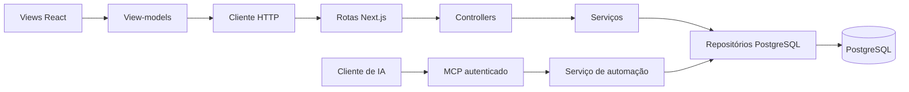

# Interview Copilot

Aplicação para organizar anotações por projeto, encontrar respostas rapidamente e acompanhar a leitura
em um teleprompter. Foi criada para apoio durante entrevistas e pode ser usada com outros roteiros e
materiais de consulta.

O frontend usa React e TypeScript. O Next.js serve a interface, a API REST e um servidor MCP.
O PostgreSQL armazena projetos, notas, ordem, preferências e histórico. A aplicação roda localmente,
com o banco no Docker, e permite alterações estruturadas por um assistente conectado ao MCP.

**Estado atual:** interface funcional, persistência em PostgreSQL e MCP autenticado implementados.
A configuração padrão publica portas apenas no loopback. A interface e a API REST não possuem login;
a autenticação do MCP protege somente seu endpoint. Não há implantação no VPS incluída neste projeto.

## Índice

- [Funcionalidades](#funcionalidades)
- [Stack](#stack)
- [Instalação e execução](#instalação-e-execução)
- [Configuração](#configuração)
- [Uso e atalhos](#uso-e-atalhos)
- [Arquitetura](#arquitetura)
- [API REST](#api-rest)
- [MCP e assistentes de IA](#mcp-e-assistentes-de-ia)
- [Banco de dados e migrações](#banco-de-dados-e-migrações)
- [Backup e recuperação](#backup-e-recuperação)
- [Comandos e validação](#comandos-e-validação)
- [VPS e limites de segurança](#vps-e-limites-de-segurança)
- [Solução de problemas](#solução-de-problemas)
- [Documentação e desenvolvimento com IA](#documentação-e-desenvolvimento-com-ia)

## Funcionalidades

### Projetos e anotações

- Criar, selecionar, editar e excluir projetos com título e descrição.
- Persistir o último projeto selecionado como padrão da instalação.
- Criar e editar notas com título, descrição, tags e conteúdo.
- Confirmar exclusões pela interface.
- Ordenar notas por arraste ou pelo teclado, com ordem persistida por projeto.
- Buscar em título, descrição, tags e conteúdo, ignorando acentos e maiúsculas e tolerando pequenos erros.

### Teleprompter

- Exibir a nota selecionada ao lado da lista.
- Iniciar, pausar e reiniciar a rolagem, ajustando fonte e velocidade.
- Acompanhar o progresso da leitura.
- Localizar palavras e trechos no conteúdo, com destaque e navegação entre ocorrências.
- Converter texto corrido em linhas curtas nos formulários de criação e edição.

A formatação do teleprompter é local e preserva as palavras. Não usa IA para reescrever o texto.
Trocar de nota ou projeto, rolar manualmente ou sair da aba interrompe a leitura automática.

### Automação por MCP

- Consultar projetos e pesquisar notas por ferramentas estruturadas.
- Criar e editar várias notas em uma única transação.
- Reordenar, preparar exclusões e executar a prévia confirmada.
- Consultar histórico e recuperar notas excluídas enquanto o projeto existir.
- Impedir sobrescrita silenciosa por versão e duplicação de operações em retries.

## Stack

| Área                       | Tecnologia                                               |
| -------------------------- | -------------------------------------------------------- |
| Runtime                    | Node.js 24                                               |
| Linguagem                  | TypeScript com modo estrito                              |
| Interface                  | React 19 e CSS próprio                                   |
| Aplicação e backend        | Next.js 16, App Router e Route Handlers                  |
| Banco                      | PostgreSQL 18 no Docker                                  |
| Acesso ao banco            | Driver `pg`, SQL parametrizado e migrações SQL           |
| Validação                  | Zod                                                      |
| Integração com assistentes | SDK oficial `@modelcontextprotocol/sdk`, Streamable HTTP |
| Testes                     | Node Test Runner com `tsx`                               |
| Formatação                 | Prettier                                                 |
| Ambiente local             | Docker Compose                                           |

As versões instaladas estão em [package.json](package.json) e [yarn.lock](yarn.lock).
Não há ORM ou framework de design system. Frontend e backend fazem parte da mesma aplicação Next.js.

## Instalação e execução

Execute os comandos na pasta que contém este README, `package.json` e `compose.yaml`.

### Requisitos

- Docker com Docker Compose disponível e em execução.
- Make para usar os comandos unificados.
- Node.js 24 e Yarn somente para desenvolvimento e scripts executados no computador.
  Build e validações pelo Makefile rodam em containers.
- Portas locais 8765 e 55432 livres, conforme a configuração padrão.

### Caminho rápido com Make

```sh
make help
make env
```

Edite `.env` com suas credenciais e prepare `data/initial-notes.json` para o primeiro seed. Em seguida:

```sh
make up
```

Abra [http://localhost:8765](http://localhost:8765). `make env` preserva um `.env` existente.
Esse caminho precisa apenas de Make e Docker. Para desenvolvimento com Node no computador,
siga as instruções abaixo. Todos os comandos Make devem ser executados na raiz.

### 1. Preparar o ambiente

```sh
corepack enable
yarn install --immutable
```

Somente em uma instalação nova, se `.env` ainda não existir:

```sh
cp .env.example .env
```

Edite o `.env` e substitua a senha de exemplo. Use as mesmas credenciais em `POSTGRES_PASSWORD` e
`DATABASE_URL`. Preserve o arquivo já configurado quando estiver retomando uma instalação existente.

O seed lê `data/initial-notes.json`. Para transferir sua coleção, prepare esse arquivo com um backup
JSON antes da primeira inicialização. Para uma instalação nova sem notas, o conteúdo pode ser `[]`.
Não substitua o arquivo pessoal da instalação atual para experimentar uma base vazia.

### 2. Escolher o modo de execução

**Aplicação e banco no Docker:**

```sh
docker compose --profile full up -d --build --wait
```

O Compose compila o aplicativo, aguarda o banco, aplica migrações pendentes, executa o seed uma vez e
inicia o Next.js. O processo da aplicação roda como usuário `node` dentro do container.

**Desenvolvimento com atualização automática:**

```sh
yarn setup
yarn dev
```

Nesse modo, o banco roda no Docker e o Next.js roda no computador. `setup` inicia o banco, aplica as
migrações e executa o seed. Não mantenha o serviço `app` do Docker ocupando a mesma porta; se estiver
ativo, pare somente esse serviço com `docker compose stop app` antes de executar `dev`.

Nos dois modos, abra [http://localhost:8765](http://localhost:8765).

### Versão compilada fora do container

Com dependências instaladas, banco iniciado e migrações aplicadas:

```sh
yarn build
yarn start
```

### Parar e acompanhar os containers

```sh
docker compose ps
docker compose logs --tail=100 app
docker compose --profile full down
```

`down` preserva o volume do banco. A opção `down -v` remove o volume e seus dados.
Alterações no código exigem nova execução de `up -d --build --wait` no modo Docker.
Detalhes operacionais estão em [docs/operations.md](docs/operations.md).

## Configuração

Use [.env.example](.env.example) como contrato de configuração, sem incluir segredos no código.

| Variável              | Finalidade                                                    |
| --------------------- | ------------------------------------------------------------- |
| `POSTGRES_USER`       | Usuário do PostgreSQL criado na inicialização do volume       |
| `POSTGRES_PASSWORD`   | Senha do banco                                                |
| `POSTGRES_DB`         | Nome do banco                                                 |
| `POSTGRES_PORT`       | Porta publicada no computador, padrão `55432`                 |
| `DATABASE_URL`        | Conexão usada pelo Next.js e scripts executados no computador |
| `MCP_SERVER_URL`      | URL do MCP, localmente `http://localhost:8765/api/mcp`        |
| `MCP_ACCESS_TOKEN`    | Bearer de leitura e escrita                                   |
| `MCP_READ_ONLY_TOKEN` | Bearer opcional somente para leitura                          |
| `MCP_PROJECT_IDS`     | IDs autorizados separados por vírgula, ou `*` para todos      |

No container da aplicação, Compose monta `DATABASE_URL` usando o serviço `db` e a porta 5432.
No computador, a URL usa `127.0.0.1` e a porta publicada. Se alterar `POSTGRES_PORT`, ajuste também a
URL usada no computador. Caracteres reservados em credenciais precisam ser codificados na URL.

Mudar a senha no `.env` não troca automaticamente a senha de um banco já inicializado.
O MCP fica indisponível quando sua configuração está ausente ou inválida; a interface continua independente.

## Uso e atalhos

1. Use **Alterar projeto** para selecionar ou administrar seus projetos.
2. Use **+ Nova anotação** para cadastrar título, descrição, tags e texto.
3. Filtre a lista e selecione uma nota para abrir seu conteúdo no teleprompter.
4. Ajuste fonte e velocidade e inicie a leitura.
5. Para reordenar a lista, limpe a busca e arraste pelo controle de movimentação.

| Atalho                                       | Ação                                          |
| -------------------------------------------- | --------------------------------------------- |
| `Ctrl/Command + K`                           | Foca e seleciona o filtro da lista            |
| `Escape` no filtro                           | Limpa a busca da lista                        |
| Setas e `Enter` no filtro                    | Navega e abre uma nota                        |
| `Ctrl/Command + F`                           | Foca a busca do teleprompter                  |
| `Enter` / `Shift + Enter` na busca do leitor | Próxima / anterior ocorrência                 |
| `Escape` na busca do leitor                  | Limpa essa busca                              |
| `Espaço` fora dos controles                  | Inicia ou pausa a leitura                     |
| `Escape` no modal                            | Fecha quando não existe operação em andamento |

A seleção de projeto é uma preferência global da instalação, não de uma conta individual.
Mudanças feitas em outra janela ou pelo MCP exigem recarregar a interface.

## Arquitetura

O frontend usa MVVM: componentes cuidam da apresentação, view-models coordenam estado e comandos,
e os clientes HTTP acessam o backend. A fronteira REST segue MVC com controllers, serviços e
repositórios; React fornece a camada de apresentação.



Os serviços dependem de contratos definidos no domínio. As implementações concretas são conectadas em
`src/server/composition.ts`. UI e MCP compartilham operações de notas; lotes MCP usam uma transação
única, sem abrir transações independentes para cada item.

```text
src/
  app/                 Página, layout e rotas HTTP do Next.js
  client/
    components/        Views e formulários React
    view-models/       Estado, comandos e interações
    api/               Acesso HTTP e validação de respostas
    styles/            CSS por área
  domain/              Modelos, contratos, validações e regras puras
  server/
    controllers/       Entrada e saída da API REST
    services/          Casos de uso e autorização da automação
    repositories/      Persistência, lotes, histórico e backup
    database/          Pool e transações
    http/              Leitura JSON e tradução de erros
    mcp/               Autenticação, transporte e ferramentas MCP
    logging/           Diagnósticos sem conteúdo pessoal
    composition.ts     Composição das dependências
migrations/            Migrações SQL versionadas
scripts/               Configuração, migração, importação e exportação
tests/                 Testes de domínio, contratos, arquitetura e integração
data/                  Arquivo de importação inicial
docker/
  app/Dockerfile       Estágios de dependências, ferramentas, build e runtime
  app/entrypoint.sh    Migração, seed e início do processo
  compose.test.yaml    Banco descartável e runner de testes separados
  backup.sh            Dump completo com arquivo único e proteção de permissões
compose.yaml           App e banco persistente, com portas locais
Makefile               Comandos de operação e qualidade
backups/               Cópias locais, fora da execução normal
docs/                  Documentação compartilhada
```

A busca trabalha em memória sobre as notas carregadas do projeto. PostgreSQL é a fonte de verdade;
JSON serve para importação e exportação. Veja [arquitetura](docs/technical-overview.md) e
[padrões de engenharia](docs/engineering-standards.md).

## API REST

A interface usa a API local abaixo. Rotas de notas exigem `?projectId=<id>`.

| Método          | Rota                      | Operação                                       |
| --------------- | ------------------------- | ---------------------------------------------- |
| `GET`, `POST`   | `/api/notes`              | Listar e criar notas                           |
| `PUT`, `DELETE` | `/api/notes/:id`          | Editar e excluir uma nota                      |
| `PUT`           | `/api/notes/order`        | Persistir a ordem completa do projeto          |
| `GET`, `POST`   | `/api/projects`           | Listar e criar projetos                        |
| `PUT`, `DELETE` | `/api/projects/:id`       | Editar e excluir projetos                      |
| `PUT`           | `/api/projects/selection` | Persistir o projeto selecionado                |
| `GET`           | `/api/health`             | Verificação básica de acesso à tabela de notas |

Rascunhos contêm `title`, `description`, `tags` e `content`. Edição e exclusão usam `version` para
detectar conflitos. Respostas de dados não são cacheadas. O health não verifica todas as funcionalidades.
Payloads, limites e códigos de erro estão no [contrato REST](docs/api/README.md).

## MCP e assistentes de IA

O endpoint é `POST /api/mcp`, com JSON-RPC sobre Streamable HTTP sem sessão. O assistente interpreta o
pedido e envia argumentos estruturados. O backend valida e executa a operação; não chama a OpenAI
nem precisa de chave de API de um modelo.

### Ativar

```sh
yarn mcp:setup
docker compose --profile full up -d --build --wait
```

O setup gera credenciais no `.env`, preserva valores existentes e não imprime tokens.
Se estiver usando `yarn dev`, reinicie esse processo após configurar o ambiente.
Para cadastrar a conexão no cliente de IA, siga o [guia do MCP](docs/api/mcp.md#conectar-no-codex).
O setup da aplicação não cadastra automaticamente a conexão no Codex.

### Ferramentas disponíveis

| Ferramenta              | Finalidade                                  |
| ----------------------- | ------------------------------------------- |
| `list_projects`         | Consultar projetos autorizados              |
| `search_notes`          | Buscar e listar resumos paginados           |
| `get_note`              | Ler uma nota completa e sua versão          |
| `create_notes`          | Criar de 1 a 50 notas por chamada           |
| `update_notes`          | Aplicar de 1 a 50 patches por chamada       |
| `reorder_notes`         | Definir a ordem completa de um projeto      |
| `prepare_note_deletion` | Congelar os alvos em uma prévia de exclusão |
| `execute_note_deletion` | Executar a prévia confirmada                |
| `list_deleted_notes`    | Localizar notas recuperáveis                |
| `note_history`          | Consultar revisões                          |
| `restore_note`          | Restaurar conteúdo de uma revisão           |

A credencial de leitura acessa apenas as cinco ferramentas de consulta. O escopo de projetos é
verificado no serviço. CRUD de projetos continua na interface, não nas ferramentas MCP.

Exemplos de pedidos depois de conectar o assistente:

- “No projeto Interview Copilot, encontre as notas sobre liderança.”
- “Altere a descrição destas duas notas e mantenha o restante.”
- “Me ajude a preparar uma resposta e cadastre como nova nota.”
- “Mostre a prévia para apagar todos os itens deste projeto.”

Edições em lote são atômicas e preservam campos omitidos. Mutações exigem `requestId` para repetição
segura. A prévia de exclusão dura 10 minutos, congela IDs e versões e deve ser apresentada ao usuário
antes da confirmação. Novas notas não são incluídas silenciosamente. A confirmação humana é uma regra
do cliente; o backend valida o token da prévia, não a conversa da pessoa.

Consulte [contratos, exemplos e limites do MCP](docs/api/mcp.md) para os payloads e o fluxo de recuperação.

## Banco de dados e migrações

| Tabela               | Conteúdo                                           |
| -------------------- | -------------------------------------------------- |
| `projects`           | Projetos, descrição e versão                       |
| `notes`              | Notas, vínculo ao projeto, posição, versão e datas |
| `app_settings`       | Projeto selecionado                                |
| `schema_migrations`  | Migrações aplicadas                                |
| `data_imports`       | Controle da importação inicial                     |
| `note_history`       | Snapshots de notas e autoria técnica das mudanças  |
| `mcp_requests`       | Resultados usados na idempotência                  |
| `mcp_deletion_plans` | Alvos, validade e consumo das prévias              |

Migrações são aplicadas em ordem pelo script `db:migrate`. Acrescente novos arquivos em vez de editar
migrações já aplicadas. O seed é controlado por um marcador e não recria notas excluídas em reinícios.

As escritas usam transação e serialização por schema, deliberada para uma coleção pequena. A posição
é única por projeto. Versões protegem edições e exclusões; reordenar não altera a versão de conteúdo.
O histórico registra também mudanças da interface, mas não gera revisão quando só a posição muda.

O volume `postgres_data` mantém o banco entre reinícios. Dados do volume não fazem parte de uma simples
cópia da pasta do projeto. Detalhes estão em [docs/database.md](docs/database.md).

## Backup e recuperação

### Dados ativos em JSON

```sh
yarn db:export
```

Gera um arquivo em `backups/` com projetos, notas ativas, versões, ordem e seleção. Para importar em
uma **instalação nova com banco vazio**, coloque a cópia escolhida em `data/initial-notes.json` antes do
primeiro `setup` ou início pelo Compose. Não remova o marcador do seed para forçar uma reimportação
sobre uma base em uso.

Esse formato não inclui histórico, notas excluídas, prévias ou resultados idempotentes.

### Cópia completa do PostgreSQL

O comando recomendado cria um arquivo com nome único, inclui histórico e não sobrescreve backups:

```sh
make db-backup
```

Escolha um nome novo para cada arquivo, evitando sobrescrever a única cópia existente:

```sh
mkdir -p backups
docker compose exec -T db sh -c 'pg_dump -U "$POSTGRES_USER" -d "$POSTGRES_DB" -Fc' > backups/database-AAAA-MM-DD.dump
```

O dump completo preserva também o histórico e as tabelas MCP. Sua restauração usa `pg_restore` em um
banco de destino vazio, com a aplicação parada para esse destino. Valide a restauração em uma instância
separada antes de substituir a conexão ativa; não há comando Yarn de restauração completa implementado.

### Recuperar uma nota

Pelo MCP, consulte `list_deleted_notes` ou `note_history` e use `restore_note`. Uma nota excluída retorna
no fim da lista, com o mesmo ID e uma versão maior. O projeto precisa existir. Recuperar um projeto
excluído exige backup. Não há tela de lixeira ou histórico na interface.

### Transferir a aplicação

Copie o código, o lockfile e a documentação, dispensando `node_modules` e `.next`. Leve um backup recente
e configure as credenciais no destino. Reinstale dependências e restaure os dados conforme o formato
escolhido. O histórico completo requer dump, não apenas JSON.

`data/initial-notes.json`, dumps e arquivos em `backups/` podem conter dados pessoais. O arquivo de seed
fica fora do contexto de build e é montado em `/app/data` somente para leitura pelo Compose.
Não distribua a pasta pessoal ou backups como uma demonstração pública.

## Comandos e validação

O Makefile é a entrada principal para operação e qualidade. Não há alvo que apague o volume pessoal.

| Comando Make                           | Finalidade                                                  |
| -------------------------------------- | ----------------------------------------------------------- |
| `make help`                            | Listar comandos disponíveis                                 |
| `make env`                             | Criar `.env` de exemplo somente se não existir              |
| `make config`                          | Validar os dois Compose sem imprimir credenciais            |
| `make build`                           | Compilar a imagem runtime, sem iniciar serviços             |
| `make up`                              | Compilar e iniciar app/banco, aplicando migrações e seed    |
| `make down`                            | Parar serviços preservando dados                            |
| `make restart`                         | Recriar o app com a configuração atual, sem recompilar      |
| `make status` / `make logs`            | Inspecionar serviços e acompanhar logs                      |
| `make db-up`                           | Iniciar somente o banco da aplicação                        |
| `make db-migrate` / `make db-seed`     | Migrar e importar no banco da aplicação                     |
| `make db-export`                       | Exportar JSON ativo para a pasta local `backups/`           |
| `make db-backup`                       | Criar dump completo com nome único e permissão restrita     |
| `make test`                            | Testes sem banco em container                               |
| `make integration-test`                | Integração em banco descartável, separado da aplicação      |
| `make typecheck` / `make format-check` | Validar tipos e formatação em container                     |
| `make check` / `make check-all`        | Configuração, testes, tipos, formatação, integração e build |
| `make install` / `make dev`            | Instalar dependências e desenvolver com Node no computador  |
| `make format` / `make mcp-setup`       | Formatar fontes ou gerar credenciais usando Node local      |

`make check` requer `.env` para validar o Compose principal, mas não inicia a aplicação nem aplica
migrações ao banco pessoal. O banco dos testes não publica portas, usa armazenamento temporário e
é removido ao encerrar `make integration-test`, inclusive em falhas normais. Não execute duas integrações
simultâneas: elas compartilham o nome fixo do projeto Compose de testes.

Os scripts Yarn continuam disponíveis para execução direta:

| Comando                 | Finalidade                                 |
| ----------------------- | ------------------------------------------ |
| `yarn dev`              | Desenvolvimento local na porta 8765        |
| `yarn build`            | Compilar o Next.js                         |
| `yarn start`            | Executar a versão compilada no computador  |
| `yarn start:container`  | Executar o Next.js na porta interna 3000   |
| `yarn db:up`            | Iniciar e aguardar o banco local           |
| `yarn db:migrate`       | Aplicar migrações pendentes                |
| `yarn db:seed`          | Executar a importação inicial, se pendente |
| `yarn db:export`        | Exportar dados ativos para JSON            |
| `yarn setup`            | Iniciar banco, migrar e importar           |
| `yarn mcp:setup`        | Gerar a configuração local do MCP          |
| `yarn typecheck`        | Verificar tipos                            |
| `yarn test`             | Executar testes sem banco                  |
| `yarn test:integration` | Executar integração com PostgreSQL         |
| `yarn check`            | Executar typecheck e testes sem banco      |
| `yarn format:check`     | Conferir formatação                        |
| `yarn format`           | Reformatar os arquivos incluídos no script |

Para validar uma alteração de backend, com o PostgreSQL local disponível:

```sh
yarn check
yarn test:integration
yarn build
yarn format:check
```

A integração cria e remove schemas temporários, com dados sintéticos. Confira que `DATABASE_URL`
aponta para a instância local de testes/desenvolvimento. Os testes cobrem domínio, contratos,
fronteiras de arquitetura, CRUD, isolamento de projetos, versões, rollback, backup e MCP.

`yarn check` não inclui integração ou build; `make check` inclui ambos. Não existem ESLint, gate de cobertura ou suíte automatizada de
navegador. Mudanças de interface também pedem verificação no navegador. Mudanças apenas de documentação
pedem conferência de comandos, links e formatação, sem reiniciar a aplicação.
Veja [docs/testing.md](docs/testing.md).

## VPS e limites de segurança

A configuração entregue é local. O MCP possui Bearer, escopo por projeto, validação de Host/Origin e
limites de payload. Isso não fornece autenticação para o restante do Next.js.

Para uma futura publicação do MCP:

- Configurar HTTPS e `MCP_SERVER_URL` com o endereço definitivo.
- Usar credenciais próprias do ambiente e manter o PostgreSQL privado.
- Publicar somente o caminho exato `/api/mcp`, preservando Host e Authorization no proxy.
- Manter interface e REST privadas ou implementar autenticação antes de expô-las.
- Definir limites de taxa no proxy, backups e recuperação para o ambiente remoto.

Não há OAuth, contas, colaboração multiusuário, rate limiting distribuído ou sincronização ao vivo.
Histórico e resultados de operações podem conter cópias integrais das notas e não possuem purga
automática. A exclusão de uma nota ativa não equivale à eliminação de todas essas cópias.

Ao consultar notas, o cliente MCP pode levá-las ao contexto do seu provedor de IA. O backend não envia
notas espontaneamente. Consulte [segurança](docs/security-basic.md) e
[dados e privacidade](docs/privacy-and-data-protection.md).

## Solução de problemas

| Sintoma                                   | O que verificar                                                                       |
| ----------------------------------------- | ------------------------------------------------------------------------------------- |
| Porta 8765 ocupada                        | Não executar `dev` e o serviço `app` simultaneamente                                  |
| Banco não conecta                         | Docker ativo, `docker compose ps`, credenciais e porta em `DATABASE_URL`              |
| Senha mudou no `.env`, mas acesso falha   | O volume existente mantém a senha definida no banco                                   |
| Alteração de código não aparece no Docker | Recompilar com `docker compose --profile full up -d --build --wait`                   |
| Notas mudaram pelo MCP, mas a tela não    | Recarregar a página                                                                   |
| Edição retorna conflito                   | Ler a versão atual e revisar a alteração antes de tentar novamente                    |
| MCP retorna 503                           | Configuração completa e válida; banco disponível se a falha ocorrer em uma ferramenta |
| MCP retorna 401                           | Bearer ausente ou diferente do token configurado no servidor                          |
| MCP retorna 403                           | Host, Origin ou projeto fora do escopo permitido                                      |
| MCP retorna 405 ao abrir no navegador     | Endpoint espera POST do cliente MCP, não uma página GET                               |
| Nova importação não ocorre                | Seed é executado uma vez; trocar o JSON não substitui a base existente                |

Não compartilhe `.env`, tokens ou logs com dados pessoais ao investigar falhas. Diagnósticos próprios
usam códigos de evento; logs do framework e do banco têm comportamento independente.

## Documentação e desenvolvimento com IA

[docs/README.md](docs/README.md) é o índice da documentação compartilhada. Os documentos detalhados são
a referência para contratos e regras; este README apresenta o projeto e os caminhos de operação.

| Documento                                              | Uso                                          |
| ------------------------------------------------------ | -------------------------------------------- |
| [AGENTS.md](AGENTS.md)                                 | Orientações para Codex                       |
| [CLAUDE.md](CLAUDE.md)                                 | Orientações para Claude Code                 |
| [Padrões de engenharia](docs/engineering-standards.md) | Clean code, SOLID e responsabilidade única   |
| [Convenções](docs/project-conventions.md)              | Nomes, idioma e manutenção da documentação   |
| [Produto](docs/product-overview.md)                    | Comportamentos e atalhos                     |
| [Arquitetura](docs/technical-overview.md)              | Camadas e decisões técnicas                  |
| [Frontend](docs/frontend-conventions.md)               | React, MVVM e acessibilidade                 |
| [Backend](docs/backend-conventions.md)                 | Controllers, serviços e persistência         |
| [REST](docs/api/README.md)                             | Rotas, entradas e respostas                  |
| [MCP](docs/api/mcp.md)                                 | Ferramentas, conexão, autorização e exemplos |
| [Banco](docs/database.md)                              | Modelo e migrações                           |
| [Operação](docs/operations.md)                         | Execução e transferência                     |
| [Testes](docs/testing.md)                              | Critérios de validação                       |
| [Git](docs/git-workflow.md)                            | Histórico e colaboração                      |

Antes de alterar o código, leia as orientações do agente e os documentos relacionados à tarefa.
Preserve os textos pessoais, use fixtures sintéticas e mantenha os contratos coerentes com a implementação.
