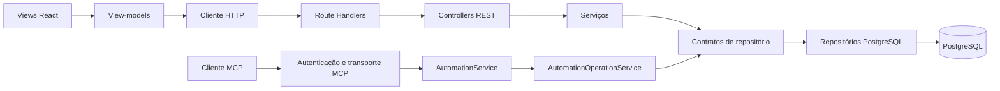

# Visão técnica

Documento vivo de como o Interview Copilot está construído, quais componentes existem, o que foi
validado e quais decisões técnicas permanecem abertas. Deve permitir retomar o trabalho sem depender
de conversas anteriores. Atualize-o na mesma mudança que alterar a arquitetura ou seu estado.

O comportamento esperado e o escopo pertencem à [visão de produto](product-overview.md).
Comandos de instalação e operação ficam no [README](../README.md) e em [operations.md](operations.md).

**Estado de referência, 24/09/2026:** aplicação Next.js com frontend React, PostgreSQL, REST local e MCP
autenticado; execução e qualidade organizadas por Docker e Makefile. Validação local concluída na
entrega de infraestrutura. Não há deploy no VPS nem conexão MCP cadastrada no Codex.

## 1. Componentes existentes

| Componente                        | Estado                   | Responsabilidade e limite                                         |
| --------------------------------- | ------------------------ | ----------------------------------------------------------------- |
| React e TypeScript                | Implementado             | Interface com MVVM e CSS próprio, sem design system externo       |
| Next.js App Router                | Implementado             | Página, layout e adaptadores HTTP no mesmo projeto                |
| API REST                          | Implementado             | CRUD de projetos/notas, seleção, ordem e health; sem autenticação |
| Serviços de domínio               | Implementado             | Validação, casos de uso e autorização da automação                |
| PostgreSQL e `pg`                 | Implementado             | Persistência real com SQL parametrizado e transações              |
| MCP                               | Implementado no servidor | Streamable HTTP autenticado; conexão ao cliente ainda pendente    |
| Histórico e idempotência          | Implementado             | Revisões de notas, prévias e resultados persistidos               |
| Docker e Makefile                 | Implementado             | Build, runtime, qualidade, banco e backups locais                 |
| Ambiente de testes separado       | Implementado             | PostgreSQL descartável, sem o volume da aplicação                 |
| Deploy remoto                     | Não implementado         | VPS é direção do produto; domínio e operação ainda não definidos  |
| Login da interface e multiusuário | Não implementado         | Exigem decisões de produto e implementação própria                |

Runtime Node.js 24, React 19, Next.js 16, PostgreSQL 18, TypeScript estrito, Zod, driver `pg` e SDK oficial
`@modelcontextprotocol/sdk`. As versões resolvidas são mantidas em [package.json](../package.json) e
[yarn.lock](../yarn.lock). Não há ORM, GraphQL, NestJS ou monorepo.

## 2. Arquitetura e fronteiras

MVVM organiza o frontend. Componentes renderizam e recebem interações; view-models coordenam estado,
comandos e requisições; `client/api` concentra o transporte e a validação das respostas.
`useWorkspaceViewModel` coordena seleção, pausa do leitor e abertura dos diálogos.

MVC organiza a fronteira REST, com React como apresentação. Controllers adaptam HTTP, serviços
validam e coordenam casos de uso e repositórios implementam persistência. MCP possui seu próprio
adaptador de transporte e delega ao serviço de automação, sem converter chamadas em requisições REST.

Serviços dependem de contratos do domínio. Implementações concretas são montadas em
[`composition.ts`](../src/server/composition.ts). O domínio não depende de React, Next.js ou `pg`. Seus erros usam códigos de negócio; a fronteira
HTTP traduz os códigos para os status preservados na REST e nos resultados MCP.
A camada de apresentação não executa SQL. Clean code e responsabilidade única são requisitos conforme
[engineering-standards.md](engineering-standards.md), não uma declaração de perfeição do código.

### Organização

| Local                     | Responsabilidade                                 |
| ------------------------- | ------------------------------------------------ |
| `src/app`                 | Página, layout e rotas Next.js                   |
| `src/client/components`   | Views e formulários                              |
| `src/client/view-models`  | Estado e comandos de interface                   |
| `src/client/api`          | Transporte HTTP tipado                           |
| `src/client/styles`       | CSS por área                                     |
| `src/domain`              | Modelos, contratos, validações e funções puras   |
| `src/server/controllers`  | Adaptação REST                                   |
| `src/server/services`     | Casos de uso e autorização MCP                   |
| `src/server/repositories` | SQL, sessões transacionais, importação e backup  |
| `src/server/database`     | Pool e transações                                |
| `src/server/http`         | JSON e tradução de erros                         |
| `src/server/mcp`          | Autenticação, ferramentas e protocolo            |
| `src/server/logging`      | Diagnósticos próprios                            |
| `migrations`              | Evolução SQL versionada                          |
| `scripts`                 | Fronteira de arquivos e execução administrativa  |
| `docker`                  | Construção, inicialização, testes e dump         |
| `tests`                   | Testes de comportamento, contratos e arquitetura |

A busca classifica em memória as notas do projeto carregado, combinando campos com pesos diferentes.
A busca do leitor preserva os offsets do texto para destacar ocorrências. Formatação para teleprompter
é uma transformação local, sem dependência de IA ou serviço externo.

## 3. Persistência e invariantes

PostgreSQL é a fonte de verdade. JSON é formato de importação/exportação, não o armazenamento ativo.
O modelo e as migrações estão em [database.md](database.md).

- Cada nota tem um projeto obrigatório, posição única nesse projeto e versão positiva.
- A seleção de projeto é persistida em `app_settings`, como preferência global da instalação.
- Escritas usam transações com advisory lock por schema, uma serialização deliberada para a coleção pequena.
- Edições e exclusões verificam a versão esperada; reordenação exige todos os IDs atuais do projeto.
- Alterações de ordem não incrementam a versão de conteúdo.
- Migrações aplicadas são registradas e não devem ser reescritas.
- O marcador do seed impede reimportação a cada início e recriação de notas excluídas.

`PostgresNoteSession` compartilha operações SQL entre a REST e os lotes MCP. O repositório da UI abre
uma transação por escrita; `PostgresAutomationUnitOfWork` fornece sessões na mesma conexão para
todos os itens do lote, histórico e planos de exclusão. `AutomationOperationService` coordena essas
operações por interfaces do domínio, sem SQL. A sessão de escrita exige `PoolClient`; consultas
independentes usam `PostgresNoteQueries`.
Uma falha desfaz alterações, histórico e registro idempotente daquela transação.

### Histórico e recuperação

`note_history` contém snapshots de notas, operação, identidade técnica e data. Triggers cobrem INSERT,
UPDATE e DELETE normais, incluindo a interface. Mudanças só de posição não criam revisão de conteúdo.
O baseline introduzido pela migração preservou as notas existentes.

Restauração de nota ativa exige sua versão atual e mantém a posição. Restauração de nota excluída
reutiliza o ID, incrementa a maior versão histórica e insere no fim. O projeto deve existir.
Exclusão de projeto remove notas ativas, mas não seus snapshots históricos.

O histórico não é inviolável contra administradores do banco e não cobre TRUNCATE ou triggers
explicitamente desabilitados. Não há purga automática de histórico ou resultados idempotentes.
Backup JSON inclui apenas dados ativos; dump PostgreSQL inclui as tabelas operacionais completas.

## 4. Contratos e integrações

| Fronteira                  | Implementação                               | Limite atual                       |
| -------------------------- | ------------------------------------------- | ---------------------------------- |
| Navegador para backend     | REST JSON no mesmo Next.js                  | Uso local sem login próprio        |
| Cliente de IA para backend | `POST /api/mcp`, Streamable HTTP sem sessão | Bearer pré-configurado, sem OAuth  |
| Aplicação para banco       | Pool `pg`, SQL parametrizado                | Banco local no Compose             |
| Geração de conteúdo        | Feita pelo cliente de IA, quando conectado  | Nenhuma chamada OpenAI no backend  |
| Conexão no Codex           | Instruções disponíveis                      | Cadastro ainda não realizado       |
| VPS e proxy HTTPS          | Orientações registradas                     | Nenhum ambiente remoto configurado |

Os contratos completos ficam em [REST](api/README.md) e [MCP](api/mcp.md). Zod valida entradas e
respostas do cliente HTTP; consultas usam projeções explícitas de campos. Não existe um DTO separado
para cada operação nem uma ferramenta MCP de SQL arbitrário.

MCP oferece 11 ferramentas com credencial de escrita e 5 com a de leitura. Ambas usam o escopo de
projetos configurado. Autenticação precede a inicialização do protocolo; autorização de projeto e
escrita é verificada também no serviço. Configuração inválida fecha o endpoint.

Criação e edição aceitam até 50 notas por chamada, com corpo MCP limitado a 2 MiB. Campos omitidos no
patch são preservados. Mutações persistem resultados por credencial e `requestId`: repetição idêntica
retorna o resultado anterior; uso da mesma chave com outros argumentos é recusado.

Prévias de exclusão vinculam credencial, projeto, IDs, versões e expiração de 10 minutos. O servidor
verifica essas condições atomicamente. A confirmação humana é responsabilidade do cliente, não uma
propriedade comprovada pelo token. Conteúdo recuperado deve ser tratado como dado pelo assistente.

## 5. Execução e infraestrutura

O [Compose principal](../compose.yaml) preserva os serviços `app` e `db`, o perfil `full`, o nome
`interview-teleprompter` e o volume `postgres_data`. As portas publicadas ficam em `127.0.0.1`.

O [Dockerfile](../docker/app/Dockerfile) tem estágios de dependências, ferramentas, build e runtime.
A imagem runtime roda como `node`, copia os diretórios necessários e não inclui documentação, testes,
`.env` ou notas pessoais. Ainda carrega dependências de desenvolvimento usadas pelos scripts
TypeScript de banco; não é uma imagem com dependências exclusivamente de produção.

O entrypoint aplica migrações e seed antes do processo da aplicação. Compose habilita `init`, e o
script usa `exec` para iniciar o comando. O seed vem de `./data`, montado somente para leitura,
sem entrar no contexto de build. Imagens antigas não são apagadas por essa mudança.

O [Makefile](../Makefile) é a entrada de operação e qualidade. `make up` compila e inicia;
`make down` preserva o volume; `make db-backup` cria dump com nome único e permissão restrita.
Não há alvo de remoção do volume pessoal. Comandos detalhados ficam em [operations.md](operations.md).

O [Compose de testes](../docker/compose.test.yaml) usa outro nome de projeto, PostgreSQL em tmpfs,
credenciais sintéticas e nenhuma porta ou volume compartilhado com a aplicação. O alvo de integração
remove o ambiente ao terminar, inclusive em falhas capturáveis. Duas execuções simultâneas não são
suportadas com esse nome fixo. Scripts Yarn diretos de integração usam a URL do ambiente do computador.

## 6. Decisões técnicas estabelecidas

| Decisão                                  | Motivo e consequência                                     |
| ---------------------------------------- | --------------------------------------------------------- |
| Uma aplicação Next.js                    | Interface, REST e MCP compartilham a mesma base de código |
| PostgreSQL com `pg` e migrações SQL      | Persistência explícita e transações, sem introduzir ORM   |
| MVVM no frontend e MVC na fronteira REST | Separar apresentação, coordenação e persistência          |
| SDK oficial para MCP                     | Evitar reimplementar negociação e transporte JSON-RPC     |
| Operações de notas compartilhadas        | Preservar invariantes entre interface e automação         |
| Lock transacional por schema             | Simplicidade de concorrência para o volume atual          |
| Histórico por trigger                    | Cobrir alterações normais feitas por UI, MCP ou SQL       |
| Tokens MCP pré-configurados              | Atender o operador atual sem introduzir contas ou OAuth   |
| Compose separado para testes             | Validar sem depender do volume pessoal                    |
| CSS próprio                              | Preservar a interface sem novo framework de design system |

## 7. Evidências e validação

Na entrega local de Docker e Makefile, em 24/09/2026, `make check` terminou com sucesso: configuração
Compose, 13 testes sem banco, TypeScript, formatação, 4 testes de integração e build runtime.
Essas contagens descrevem aquela execução, não são uma meta de qualidade ou garantia permanente.

Foram verificados separadamente: início da imagem, health, resposta HTTP da aplicação, ferramentas MCP
autenticadas, execução não root e ausência dos arquivos pessoais previstos na imagem. Exportação após
a troca de imagem foi comparada à anterior, preservando projetos, notas, versões, ordem e seleção.
O dump gerado teve seu catálogo lido por `pg_restore`; isso não equivale a uma restauração completa
ensaiada do volume pessoal.

| Comando                         | O que valida                                          | Limite                                                  |
| ------------------------------- | ----------------------------------------------------- | ------------------------------------------------------- |
| `make config`                   | Estrutura dos dois Compose                            | Não inicia serviços nem testa credenciais no banco      |
| `make test`                     | Domínio, contratos e fronteiras de código             | Não usa PostgreSQL                                      |
| `make typecheck`                | Tipos TypeScript em container                         | Não comprova comportamento                              |
| `make format-check`             | Formatação dos arquivos governados                    | Não substitui análise de código                         |
| `make integration-test`         | Repositórios, controllers e MCP com banco descartável | Não valida VPS ou proxy                                 |
| `make build`                    | Compilação e construção do runtime                    | Não inicia a aplicação                                  |
| `make check` / `make check-all` | Todas as etapas anteriores                            | Não cadastra cliente MCP nem executa verificação visual |
| `yarn check`                    | Typecheck e testes sem banco no computador            | Não inclui integração nem build                         |

Os testes estáticos protegem direções de importação e rejeitam `any` explícito e asserções não nulas em
`src`; não provam integralmente SOLID ou segurança. Integração MCP usa o cliente oficial com fetch
adaptado ao handler. O teste HTTP contra a aplicação em execução foi uma verificação separada.
Não há ESLint, cobertura mínima obrigatória, CI configurada ou suíte automatizada de navegador.
Veja [testing.md](testing.md) para os critérios de mudanças futuras.

## 8. Limitações e riscos técnicos

| Limitação                              | Consequência                                                                            |
| -------------------------------------- | --------------------------------------------------------------------------------------- |
| REST e interface sem autenticação      | Não publicar todo o Next.js supondo que o Bearer MCP o protege                          |
| Sem push ou sincronização entre abas   | Atualizações externas exigem recarregar a interface                                     |
| Busca em memória e lock por schema     | Abordagem atual precisa ser reavaliada se volume ou concorrência crescer                |
| Histórico e resultados sem expiração   | Podem guardar texto pessoal excluído da lista ativa                                     |
| Dependências de ferramentas no runtime | Imagem pode ser reduzida futuramente, exigindo outro fluxo de scripts                   |
| Migrações no startup                   | Falha de migração impede início; evolução para várias réplicas pede revisão operacional |
| Logs externos ao helper                | Next.js, PostgreSQL e Docker não têm seus logs controlados pelo diagnóstico próprio     |
| Health restrito à tabela de notas      | Não comprova funcionamento de todas as tabelas, MCP ou recuperação                      |
| Testes com nome Compose fixo           | Não executar duas integrações simultâneas na mesma instalação                           |

Os diagnósticos próprios contêm somente evento conhecido, nível e horário. Não recebem mensagens de
erro brutas nem texto de notas. Políticas de retenção, observabilidade e proteção dos logs de outros
componentes permanecem indefinidas para um ambiente remoto.

## 9. Decisões em aberto e continuidade

A direção de produto é operar remotamente via VPS e cliente de IA. Ainda precisam ser definidos:

- Domínio, proxy HTTPS e proteção da interface, caso ela seja publicada.
- Acesso pessoal ou multiusuário e o modelo de autorização correspondente.
- Distribuição, rotação e operação das credenciais fora do ambiente local.
- Rotina de backups, retenção e ensaio de recuperação no destino.
- Logs, monitoramento, limites de taxa e processo de atualização do VPS.

A próxima etapa compatível com essa direção é cadastrar e validar a conexão MCP no cliente escolhido.
A preparação do VPS vem com as decisões de acesso acima. Estes registros não autorizam publicar,
criar contas ou adotar serviços do projeto usado como referência. Não há migração decidida para
microserviços, ORM, infraestrutura como código ou outro framework de interface.

## Referências

- [Produto](product-overview.md): experiência, escopo e decisões de produto.
- [Engenharia](engineering-standards.md): clean code, SOLID e responsabilidade única.
- [Backend](backend-conventions.md) e [frontend](frontend-conventions.md): regras por camada.
- [Banco](database.md): invariantes, histórico e migrações.
- [Segurança](security-basic.md) e [privacidade](privacy-and-data-protection.md): limites e dados.
- [Operação](operations.md) e [testes](testing.md): procedimentos e validação.

## Gerenciamento de dependências

Yarn 4.9.2 é fixado em `packageManager` e ativado pelo Corepack. O projeto usa `yarn.lock`
e `nodeLinker: node-modules` para manter a resolução convencional de módulos. Docker e Makefile
usam instalação imutável. A imagem base prepara o Yarn durante o build em `/opt/corepack`,
compartilhado pelos estágios; iniciar o container não exige baixar o gerenciador.
A configuração segue a [documentação do Yarn](https://yarnpkg.com/configuration/yarnrc).
